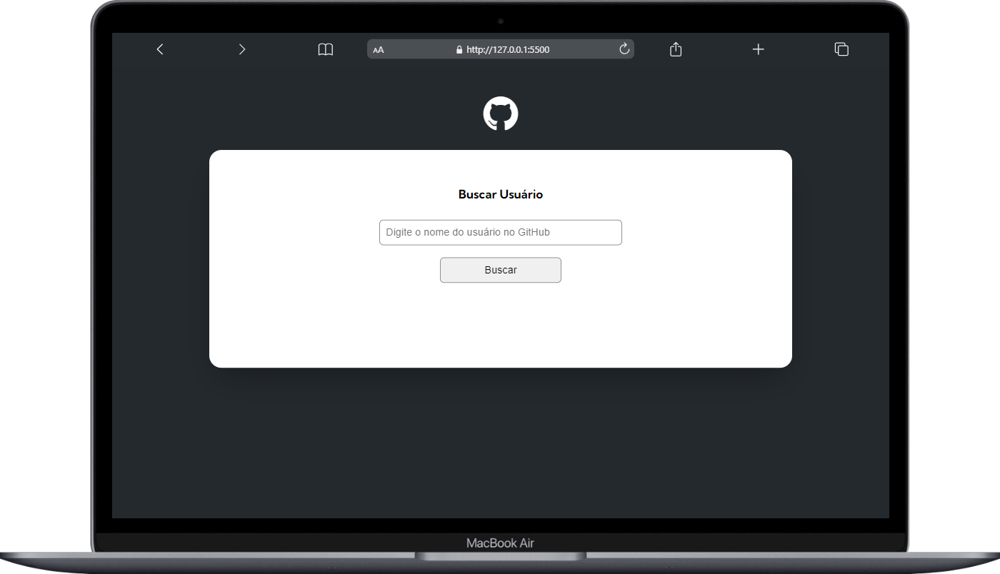

# projeto-inicial-fetch-github-api

Uma web page de busca a usuários do github!

## Documentação

- [Documentação](#)
- [Sobre o projeto](#sobre-o-projeto)
- [Design System](#design-system)
- [Objetivos principais](#objetivos-principais)
- [Tecnologias principais](#tecnologias-principais)
- [Aplicação](#aplicação)
- [Desafios](#desafios)
- [Desenvolvedor](#desenvolvedor)
- [Deploy](#deploy)
- [Executando o projeto localmente](#executando-o-projeto-localmente)

## Sobre o projeto

Projeto é uma quest do Curso de Front End DevQuest do módulo de JavaScript Avançado! 

## Objetivos principais

Desenvolver uma webpage que faz busca a usuário do github e mostrar suas informações usando JavaScript puro.

### Tela Inicial

- Campo de Busca 
- Após buscar, mostrar as informações que o usuário buscou 
- Usuário, repositórios e últimos eventos

## Design System

Utilizei alguns conceitos e ferramentas para padronizar várias etapas do projeto.

- **Aplicação das regras e padrões**: ESLint
- **Formatação automática com base nas regras**: Prettier

## Tecnologias Principais

## Aplicação

### Telas de Desktop

  
  
  
  

## Desafios

 - Manipulação de API

## Desenvolvedor

<table align="center">
    <tr>
        <td align="center">
            

                 
                    <b> Kelvin Charles  </b> 
                        
                        
            

        </td>
    </tr>
</table>

## Deploy

> https://projeto-mundo-real-fetch-api-github.vercel.app/

## Executando o projeto localmente

> Projeto iniciado usando create vite@latest.

- Clone o projeto com

  > git clone https://github.com/kelvincharlesdev/projeto-mundo-real-fetch-api-github.git

- Vá para a raiz do diretório

  > cd projeto-inicial-fetch-github-api

- Instale as dependências

  > npm install

- Inicie o servidor local

  > alt L + O
